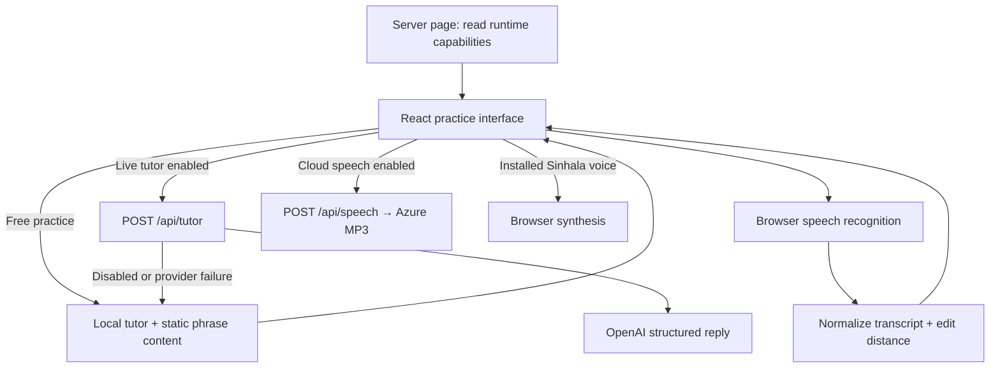

# Lanka Lingo

A personal Sinhala speaking companion for heritage learners who understand the language but struggle to retrieve sentences in conversation. Lanka Lingo combines short guided exchanges, English phrase help, and speech-recognition feedback in a local Next.js application.

**Try it without credentials:** `npm ci && npm run dev`, then open [localhost:3000](http://localhost:3000). Requires Node.js 23.6+ and npm; Chrome is the supported browser. Free practice needs no account, database, or provider keys.

## Screenshots / demo

Screenshots are not yet included. Capture these working flows and save the images under `docs/screenshots/`:

| Suggested file | What to show |
| --- | --- |
| `guided-conversation.png` | Food topic after one answer: question progress, transcript, suggested replies, and the focused phrase with all three text representations. |
| `english-help.png` | English help filtered to Food, with search results and a selected phrase visible in the conversation. |
| `phrase-practice.png` | A real microphone attempt showing the recognized Sinhala and transcript-match feedback. Do not present a simulated score as a real result. |
| `mobile-conversation.png` | The same guided workflow at a narrow mobile viewport, including the composer. |

Until images are added, the [local walkthrough](#running-the-project) provides a reproducible demo. The [existing verification record](docs/testing/free-practice-verification.md) describes prior desktop/mobile and simulated speech checks, including what they did not establish.

## Problem and workflow

The project targets a specific learning gap: comprehension can be strong while spoken sentence retrieval is slow. Its product brief focuses on practicing familiar Sinhala through a short exchange, finding a sentence when stuck, and immediately trying it aloud.

1. Start the daily topic or choose Everyday life, Family, Food, Travel, or Childhood.
2. Speak, type, or select a suggested answer through a three-question round.
3. Switch to English help to find a known sentence, then return to the same question and practice target.
4. Listen when Sinhala playback is available, repeat the target, and compare the recognized words.
5. Restart the round or choose another topic. Refreshing discards the session.

This is a personal practice prototype. Free prompts follow a fixed sequence and do not interpret answers; custom topics use disclosed generic prompts. Open-ended conversation is an optional provider integration.

## Key features

- **Guided practice with recoverable context:** explicit round progress remains separate from the transcript and English-help messages.
- **A searchable 38-phrase library:** eight essentials plus 30 replies from five topics, searchable by English, Sinhala, or romanization and filterable by topic.
- **Conservative English help:** complete known sentences and aliases resolve to saved phrases. Unknown requests show a clearly labeled repair phrase rather than claiming to translate them.
- **Speech practice with text fallback:** browser recognition, Sinhala-only playback selection, slow playback, cancellation controls, and Unicode-aware transcript comparison.
- **Optional live services:** structured tutor replies through OpenAI and MP3 synthesis through Azure Speech, behind an explicit server-side opt-in.

## Tech stack

| Area | Implementation |
| --- | --- |
| Application | Next.js 16 App Router, React 19, TypeScript with strict checking |
| Interface | React state/hooks, plain CSS, responsive layout |
| Browser speech | Web Speech recognition and synthesis interfaces |
| Server | Next.js route handlers using the Node.js runtime |
| Optional integrations | OpenAI JavaScript SDK / Responses API; Azure Speech REST API / SSML |
| Data | Static TypeScript content and page-memory session state; no database |
| Tests and tooling | Node's test runner and assertions, native TypeScript execution, npm lockfile, TypeScript compiler, Next.js production build |
| Execution | Local development or a local production server; no required cloud deployment |

## How the system works



[The server page](app/page.tsx) dynamically reads configuration and sends only `liveTutor` and `azureSpeech` booleans to the client. [Runtime configuration](src/services/runtimeConfiguration.ts) requires both `ENABLE_PAID_SERVICES=true` and the relevant credentials. Each API route checks the gate again.

In free mode, the client calls `createLocalTutorReply()` directly. Typed practice and phrase search therefore make no tutor or speech API requests. Recognition is independent: the browser may send audio to its own vendor even when the application runs locally.

With the live tutor enabled, the client posts a bounded recent conversation to the server. The adapter requests a strict JSON schema containing Sinhala, romanization, English meaning, coaching, suggestions, and a target phrase. Provider errors fall back to local replies. The client also has a 20-second tutor request timeout and a local fallback.

For optional cloud playback, the speech route returns an MP3. The client caches object URLs by phrase and playback rate for the current page session. An unsuccessful HTTP speech response allows an installed Sinhala voice fallback; network or playback exceptions instead produce a retry message. Playback never intentionally selects a default English voice.

## Architecture and data contracts

| Location | Responsibility |
| --- | --- |
| [`app/tutor-app.tsx`](app/tutor-app.tsx) | Conversation state, mode transitions, recognition lifecycle, audio playback, and practice feedback |
| [`app/phrase-library.tsx`](app/phrase-library.tsx) | Search, topic filtering, and explicit phrase selection |
| [`app/api/`](app/api/) | Validation, provider gating, and server-side integration boundaries |
| [`src/content/`](src/content/) | Topic prompts, replies, essentials, phrase lookup, and daily-topic selection |
| [`src/services/`](src/services/) | Deterministic tutor logic, capability configuration, and transcript scoring |
| [`src/providers/`](src/providers/) | OpenAI response formatting and Azure SSML / HTTP synthesis |
| [`src/domain/types.ts`](src/domain/types.ts) | Shared request, reply, message, and feedback interfaces |
| [`tests/acceptance/`](tests/acceptance/) | Offline service and content regression tests |

There are no database tables or migrations. A topic owns three prompts, each with two suggested replies. The phrase library derives its topic entries from those replies rather than maintaining a duplicate catalog. `TutorRequest` carries mode, topic, message, progress, and recent history; both tutor implementations return `TutorReply`. React keeps the displayed messages, selected phrase, feedback, and controls in memory. Nothing is saved to browser storage or a database.

### API boundaries

| Route | Input and behavior |
| --- | --- |
| `POST /api/tutor` | Validates mode, message up to 800 characters, topic up to 120 characters, history entries, and optional nonnegative integer step. Normalizes the latest 12 history entries; the OpenAI adapter sends the latest 10. Returns a local or provider reply. |
| `POST /api/speech` | Accepts text containing Sinhala characters, at most 500 characters, and a finite rate from 0.5–1.2. Returns `audio/mpeg`; disabled or invalid configuration returns 503 and provider failure returns 502. |

Credentials remain on the server. The OpenAI adapter uses `store: false`; this setting does not mean the request stays on the local machine. Azure receives the requested phrase text. The application does not save raw microphone audio.

There is **no authentication, authorization, or rate limiting**. These routes suit a trusted personal environment; enabling paid providers on a publicly reachable instance would expose the owner's provider budget to other callers. History is trimmed after JSON parsing, and there is no explicit total request-body limit in the handlers.

## Engineering decisions and tradeoffs

The reasons below follow the documented personal-tool scope; they are not claims of measured superiority over other designs.

| Decision | Why it fits | Tradeoff | Alternative |
| --- | --- | --- | --- |
| Local pure functions for default practice | Makes the core workflow available without credentials and easy to test deterministically | Finite prompts cannot respond to arbitrary meaning | Use the optional live tutor, with cost and network dependence |
| In-memory session state | Avoids accounts, storage setup, and retained conversation data | Refresh loses history; no cross-device progress | Add opt-in IndexedDB storage or a database if persistence becomes a requirement |
| Next.js client UI plus server routes | Keeps the interface and optional credential-bearing integrations in one project | The main client component handles many lifecycle concerns | Extract speech hooks; split the backend only if deployment needs justify it |
| Explicit provider opt-in | Existing environment keys alone cannot trigger billed calls | Requires configuration and a restart to enable providers | A user-facing provider settings flow with server-side authorization |
| Browser recognition plus transcript similarity | Provides immediate feedback without building an acoustic model | Browser support and recognition errors limit accuracy; no phoneme grading | Evaluate a dedicated Sinhala speech provider or reviewed recordings |
| Exact phrase lookup, permissive library search | Separates suggestions from claims about translation | Some natural paraphrases are intentionally rejected | Expand reviewed aliases or offer clearly labeled model translation |

See [constraints and decisions](docs/constraints-and-decisions.md) for the product scope and deferred choices.

## Technical challenges

**Keeping progress stable while the learner asks for help.** A message count would mix conversation answers with English requests, and a truncated history could lose position. `conversationStepRef` advances only for conversation turns. A separate `conversationTargetRef` restores the earlier target when leaving help mode. Tests cover progression with empty/truncated history and help messages. The lesson is to represent workflow position explicitly instead of reconstructing it from presentation data.

**Coordinating asynchronous speech.** Recognition, fetched audio, and browser synthesis can finish after the user stops or switches modes. The client removes recognition handlers before aborting, cancels audio fetches, and uses a monotonically increasing speech request ID to ignore stale playback work. Starting recognition stops playback. Object URLs are revoked on unmount. These lifecycle controls are more involved than rendering a microphone button, and real-device behavior still needs validation.

**Comparing Sinhala without removing meaningful marks.** Normalization uses NFC and preserves Unicode letters, combining marks, and numbers while removing punctuation and joiners. Levenshtein distance produces a normalized transcript-match score; confidence influences retry feedback. Tests distinguish vowel marks from ignorable punctuation. The calculation operates on JavaScript string units, not acoustic features or Sinhala grapheme clusters, so it is a text comparison rather than a pronunciation assessment.

**Providing help without misleading translations.** Keyword overlap could incorrectly match a negated or unrelated sentence. `findStarterPhrase()` requires equality with a normalized full sentence or alias, while `searchPhraseLibrary()` allows partial terms for explicit user selection. Tests reject examples such as “I do not want tea please.” Unknown requests retain an explanatory notice alongside the repair phrase. The tradeoff is narrower coverage in exchange for a clearer promise to the learner.

## Deep dive: asking for English help without losing the conversation

1. The learner selects a topic. `startConversation()` resets its step and requests the opening prompt from [the local tutor](src/services/localTutor.ts).
2. Selecting a suggested answer sets both the visible target and `conversationTargetRef`. Sending it increments `conversationStepRef` and advances the round.
3. `changeMode("english-help")` stops microphone/audio activity without advancing the question. [The library](app/phrase-library.tsx) offers search and category filters.
4. Selecting a phrase sends its displayed English meaning through the same help flow as typed input. [Phrase lookup](src/content/phrases.ts) removes supported helper framing and matches a complete known sentence or alias.
5. `applyTutorReply()` displays the help sentence and changes the visible practice target, while leaving conversation suggestions and progress intact. A pronunciation attempt compares recognition against this temporary target.
6. `changeMode("conversation")` restores the saved conversation target. The next conversation answer advances exactly one question; help exchanges do not consume the round.

This separation lets one transcript show both kinds of interaction while maintaining independent conversation progress and practice focus.

## Running the project

Use Node.js **23.6 or newer** as required by `package.json`; tests execute TypeScript directly. Chrome is the supported speech browser.

```bash
git clone https://github.com/mkodithuwakku/Lanka-Lingo.git
cd Lanka-Lingo
npm ci
npm run dev
```

Open [localhost:3000](http://localhost:3000). No environment file or database setup is needed for free practice. Choose Food, send a suggestion, use English help to find a phrase, return to Sinhala, and finish the round. Playback is disabled if no installed Sinhala voice is available; typed practice remains usable.

### Optional providers

Copy the template and edit it locally:

```bash
cp .env.example .env.local
```

| Variable | Purpose |
| --- | --- |
| `ENABLE_PAID_SERVICES` | Defaults to disabled; must be exactly `true` to enable configured providers |
| `OPENAI_API_KEY` | Enables the live tutor when the opt-in flag is set |
| `OPENAI_MODEL` | Model override; the adapter currently defaults to `gpt-5.6`. Select a compatible model available to your API account; the configured default has not been verified with a live call. |
| `AZURE_SPEECH_KEY`, `AZURE_SPEECH_REGION` | Enable cloud synthesis when both are present and paid services are enabled |
| `AZURE_SPEECH_VOICE` | Defaults to `si-LK-ThiliniNeural`; the adapter also accepts `si-LK-SameeraNeural` |

Restart the server after changing configuration. Tutor and speech can be enabled independently through their credentials. Keep keys in the ignored `.env.local`; provider use may incur charges. Microphone permission and browser support are separate from provider configuration.

### Checks and production server

```bash
npm test       # 20 offline tests; no credentials or provider requests
npm run build  # Production compilation and generated Next.js types
npm run check  # TypeScript validation
npm start      # Serve the completed production build
```

The automated suite covers phrase retrieval/search, rejected partial and negated matches, round progression, opt-in gating, Sinhala normalization, and SSML escaping/rate/voice rules. It does not exercise live providers, real microphone audio, or the full rendered interface. [Testing documentation](docs/testing/README.md) provides the manual regression flow; the [prior verification record](docs/testing/free-practice-verification.md) distinguishes browser simulations from real speech checks.

## Current limitations and next improvements

- **Language quality needs review.** A fluent colloquial Sinhala speaker should verify the existing phrases, meanings, and romanization before they become repeated learning material.
- **Real speech and paid integrations remain unverified.** Record actual microphone and installed-voice checks, then separately validate a configured model and Azure synthesis when provider spending is intended.
- **Browser regression coverage is not automated in the checked-in suite.** Add repeatable UI and route tests for cancellation, mode restoration, provider failures, and invalid request bodies.
- **The client component is large.** Extract recognition and playback lifecycle code into focused hooks, with tests for delayed results and cleanup. The session audio cache also has no size/eviction policy.
- **Public hosting needs additional controls.** Add authentication, request-size limits, rate limits, and explicit provider timeouts before exposing paid routes. Local fallback avoids a broken conversation but can still change the experience mid-session.
- **Offline installation is incomplete.** The manifest has no icons, and there is no service worker. Local practice after loading does not establish offline reload or microphone support.
- **Sessions are temporary by design.** There are no accounts, saved progress, or multi-user collaboration. Separate browser sessions do not share application state, but public callers would share the server's provider credentials and budget.

## What this project demonstrates

- Building a TypeScript application with a clear browser/server credential boundary.
- Modeling conversation state independently from display history and temporary help interactions.
- Integrating structured model output and speech synthesis behind a deterministic local experience.
- Handling browser media lifecycles, cancellation, fallbacks, and in-memory resource cleanup.
- Designing Unicode-aware text comparison and regression tests around language-specific edge cases.

Further reference: [product specification](SPECIFICATION.md), [architecture](docs/architecture.md), and [local development](docs/local-development.md).
