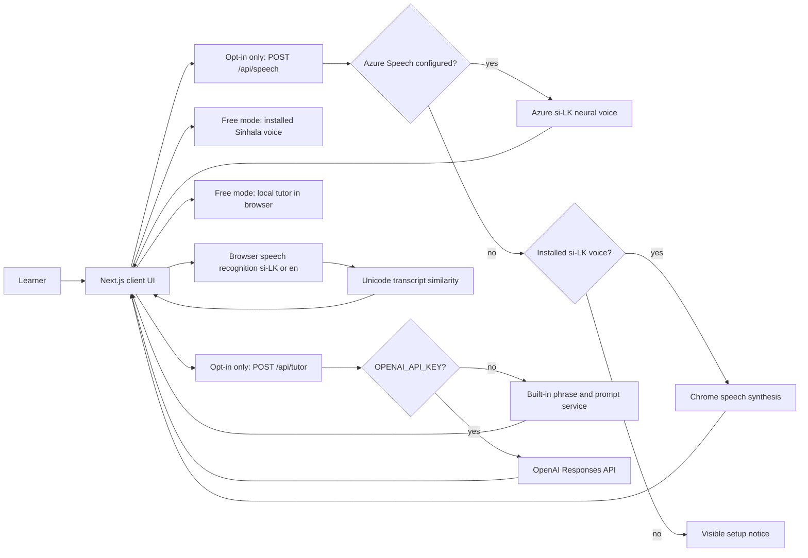

# System Architecture

## Design

Lanka Lingo is a local Next.js application optimized only for Chrome, with an intentionally small state surface. The browser owns the current topic, ephemeral conversation, speech controls, and audio playback. Server routes own optional tutor and speech credentials. Pure TypeScript services provide topic-specific credential-free conversations and pronunciation comparison.

## Free Mode Boundary

`app/page.tsx` reads configuration during dynamic rendering and passes only two capability booleans to the client. `src/services/runtimeConfiguration.ts` requires `ENABLE_PAID_SERVICES=true` plus each provider's credentials. Server routes enforce the same gate.

Without live-tutor capability, the UI calls the pure local tutor directly; it makes no `/api/tutor` requests. Without Azure capability, playback considers only an installed Sinhala voice and makes no `/api/speech` requests. Provider keys are never serialized.

Guided rounds carry an explicit conversation step independent of the bounded history sent to a live provider. English-help messages do not increment it. Each free round ends after three answers, with restart and next-topic actions. The active conversation practice target is restored when leaving English help.

`app/phrase-library.tsx` displays the 38 entries assembled from existing essentials and topic replies in `src/content/phrases.ts`. Search is permissive and only helps the user choose; translation lookup requires a complete known sentence or alias. Unknown requests show a persistent explanation before the offered repair phrase.

## Runtime Boundaries

- `app/phrase-library.tsx`: phrase search, category filtering, and explicit selection.
- `app/tutor-app.tsx`: client-only interaction state, microphone recognition, playback, mode switching, transcript, and pronunciation feedback.
- `app/api/tutor/route.ts`: validates and bounds input, removes English helper framing, selects the configured provider, and provides a local fallback.
- `app/api/speech/route.ts`: validates Sinhala text and playback rate, then returns Azure-generated MP3 audio without exposing credentials.
- `src/providers/openaiTutor.ts`: server-only OpenAI Responses API adapter using strict structured output and `store: false`.
- `src/providers/azureSpeech.ts`: server-only Sri Lankan Sinhala SSML and Azure Speech REST adapter.
- `src/services/localTutor.ts`: deterministic three-question guided rounds, completion metadata, retrieval scaffolds, and known English-to-Sinhala phrases.
- `src/content/topics.ts`: five preset conversation tracks, custom-topic fallback prompts, and daily-topic selection.
- `src/services/pronunciation.ts`: provider-free Sinhala-aware transcript similarity.
- `src/content/phrases.ts`: existing phrase catalog and searchable topic replies, pending fluent-speaker review.
- `src/domain/types.ts`: shared request, reply, conversation, and feedback contracts.

## State And Storage

Conversation state is held in React memory and is discarded on refresh. Lanka Lingo does not write raw audio, transcripts, profiles, or progress to a database or browser storage. This keeps the personal tool simple and reduces privacy risk.

## Speech Strategy

The client uses the browser Web Speech interfaces for recognition:

- Auto-play starts off. Voice availability is detected on mount and on `voiceschanged`; unavailable audio controls are disabled. Recognition can be canceled and does not run alongside playback.
- Transcript comparison retains Sinhala combining marks and ignores punctuation/joiners.
- Recognition language is `si-LK` in conversation and pronunciation practice.
- Recognition language is `en-CA` in English rescue mode.
- When Azure capability is enabled, playback requests `/api/speech` first. The route uses `si-LK-ThiliniNeural` by default and supports `si-LK-SameeraNeural`.
- Generated MP3 object URLs are cached only in page memory so replaying a phrase does not make another provider call during the session.
- If Azure is unconfigured or unavailable, browser synthesis is allowed only after finding an installed voice whose locale starts with `si-`. Default English synthesis is never used.

Chrome is the only supported browser, which removes the need for cross-browser speech abstractions in the prototype. Recognition may still be implemented as a browser-vendor cloud service. Azure was selected for synthesis because it explicitly provides Sri Lankan Sinhala voices; OpenAI's documented TTS language list does not include Sinhala.

## Tutor Strategy

The optional tutor uses the OpenAI Responses API because the UI requires predictable structured fields. The tutor prompt is fixed to a comprehension-strong heritage learner, neutral colloquial Sinhala, casual register, topic continuity, and a mandatory follow-up question. The response schema requires Sinhala, romanization, English meaning, coaching, suggested replies, and an active practice phrase. The model name is configurable with `OPENAI_MODEL`.

The built-in tutor supplies finite guided practice rounds and the phrase library without credentials. Its prompts are scripted and do not interpret the learner’s answer.

## Security And Failure Handling

- Provider credentials exist only in `.env.local` and server code.
- The request route limits message length and conversation history.
- AI calls set `store: false`.
- A provider failure returns a local reply with a visible fallback notice.
- Speech requests accept only bounded text containing Sinhala characters and a bounded playback rate.
- Azure region and voice values are allow-listed before constructing the provider request.
- No secrets, provider error bodies, or stack traces are returned to the browser.
