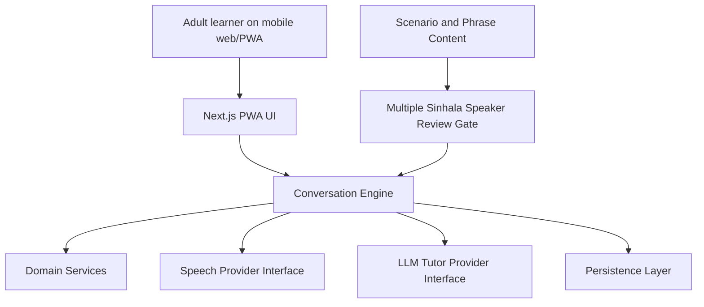

# System Architecture

## Purpose

Lanka Lingo is a mobile-first web/PWA that teaches colloquial spoken Sinhala through guided AI conversation. The architecture keeps the language-learning logic testable without live AI or speech credentials, while isolating provider-specific code behind interfaces.

## Architecture Overview

## Current Implementation Layers

- `app/`: mobile-first PWA shell. It currently presents the first conversation card and product principles.
- `src/domain/`: shared domain types for learners, scenarios, phrases, speech signals, tutor turns, and progress.
- `src/content/`: seed scenarios and target phrases from the specification.
- `src/services/`: testable business logic for onboarding, suggestions, pronunciation heuristics, privacy, progress, content review, session review, and conversation orchestration.
- `src/providers/`: provider contracts and not-configured stubs for Azure Speech. Live credentials should be added later through server-side configuration only.
- `tests/acceptance/`: Node test suite mapped to user stories and acceptance criteria from `SPECIFICATION.md`.

## Provider Strategy

The recommended MVP provider split is:

- Azure AI Speech for Sinhala `si-LK` speech-to-text and Sinhala neural text-to-speech.
- OpenAI for tutor reasoning, structured lesson state, hint generation, correction framing, and safety guardrails.
- Internal pronunciation heuristics for MVP pronunciation feedback, because Sinhala phoneme-level pronunciation assessment is not broadly available.

Provider code must stay behind interfaces so the project can evaluate replacements without rewriting the learning loop.

## Conversation Flow

1. Learner opens a guided scenario.
2. UI requests microphone permission with a clear explanation.
3. Speech provider returns transcript, confidence, and audio-quality metadata.
4. Conversation engine evaluates pronunciation and generates structured tutor state.
5. LLM provider will eventually fill natural tutor text; current implementation uses deterministic scaffolding.
6. Suggested replies include English meaning and romanized Sinhala.
7. Progress events update learner state.
8. Session review summarizes practiced phrases, pronunciation notes, and next steps.

## Privacy Model

Raw audio retention is disabled by default. The app may process audio to support conversation, but raw audio is only stored if a learner explicitly opts in after reading the explanation. Transcripts and learning progress must be clearly disclosed and configurable.

## Content Release Gate

Before public release, scenario content must be reviewed by multiple Sinhala speakers for colloquial phrasing. The current `contentReview` service requires at least two reviewer approvals before a scenario can be marked release-ready.

## Architectural Rules

- Keep user-story behavior in pure services where possible.
- Keep provider credentials server-side only.
- Do not make reading or writing Sinhala script required for the MVP.
- Keep romanized Sinhala as a first-class learner-facing support format.
- Keep tests mapped to spec user stories as the suite grows.
